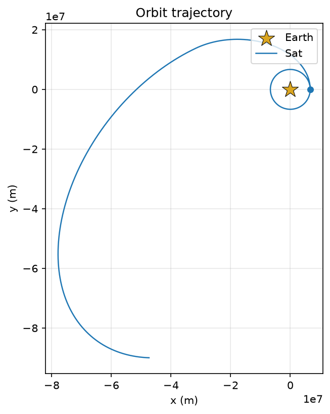
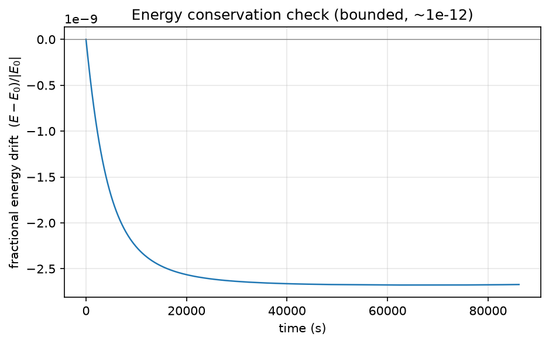

# Hohmann Transfer Physics Sim

A 2D N-body gravity simulator in plain Python that flies a spacecraft from low Earth orbit (LEO) toward geostationary orbit (GEO) using a two-burn **Hohmann transfer**.

This is the capstone project for an introductory Python course on mathematical modeling. It integrates the motion numerically with **Velocity Verlet**, checks the result against closed-form orbital mechanics, and draws the trajectory and an energy-conservation plot.

<p align="center">
  
  
</p>

## Features

- **N-body gravity.** Every body pulls on every other body (Newton's law of universal gravitation). The code isn't limited to two bodies.
- **Velocity Verlet integrator.** A symplectic, second-order method, so energy error stays bounded instead of growing the way it does with forward Euler.
- **Analytic cross-checks.** Closed-form circular velocity, escape velocity, vis-viva, orbital period, and Hohmann Δv, each with doctests.
- **Run diagnostics.**
  - Prints total-energy drift every `report_every` steps.
  - Stops the run if two bodies collide (their radii overlap).
  - Warns when a body reaches an escape trajectory (its specific orbital energy turns positive).
- **Mission report.** Periapsis, apoapsis, semi-major axis, eccentricity, and the analytic period alongside the numerically measured one.
- **Plots.** The orbit path (`orbit.png`) and fractional energy drift over time (`energy.png`), drawn with matplotlib.

## Getting started

### Requirements

- Python 3.10+
- [matplotlib](https://matplotlib.org/)

```bash
pip install matplotlib
```

### Run the simulation

```bash
python simulation.py
```

This runs the Hohmann transfer scenario. It prints energy diagnostics and a mission report to the terminal and writes `orbit.png` and `energy.png` to the project directory.

### Run the doctests

```bash
python analytic_physics.py   # orbital-mechanics formulas
python Vector.py             # vector arithmetic
```

## How it works

### The integrator

Each time step `dt` runs the standard Velocity Verlet update:

1. **Drift:** `x(t+dt) = x(t) + v(t)·dt + ½·a(t)·dt²`
2. **Recompute** the accelerations at the new positions to get `a(t+dt)`.
3. **Kick:** `v(t+dt) = v(t) + ½·(a(t) + a(t+dt))·dt`
4. **Hand off:** `a(t) ← a(t+dt)` for the next step.

Every body stores its current and next acceleration (`cur_ac`, `nxt_ac`), so the force calculation only runs once per step.

### The Hohmann transfer scenario

Earth's gravitational parameter is μ = G·M_earth.

| Phase | What happens |
|---|---|
| 1. Parking orbit | The satellite circles Earth at r₁ = 6,678 km (300 km altitude) for one orbital period. |
| 2. Burn 1 | A prograde Δv puts it on an elliptical transfer orbit with semi-major axis a = (r₁ + r₂)/2. |
| 3. Coast | It coasts along the transfer ellipse toward apoapsis at r₂ = 42,160 km. |
| 4. Burn 2 | A second prograde Δv circularizes the orbit at GEO radius. |
| 5. GEO | It stays in the final orbit for one GEO period. |

`analytic_physics.hohmann_transfer(r1, r2, mu)` computes both burns with vis-viva: each burn is the difference between the transfer-ellipse speed and the circular speed at that radius. From a 250 km LEO, the total comes to about **3.9 km/s**.

### Energy conservation

The integrator should conserve total energy (kinetic energy plus pairwise gravitational potential energy). The plot shows fractional drift, `(E − E₀)/|E₀|`, rather than raw joules. Raw joules would make matplotlib zoom in on noise in the 12th digit. In the run pictured above, the drift stays around 10⁻⁹.

## Project structure

| File | Purpose |
|---|---|
| `simulation.py` | Entry point: Verlet integrator, diagnostics, and scenario setup |
| `Body.py` | `Body` base class, plus the `Planet` and `Spacecraft` subclasses (`Spacecraft.apply_burn`) |
| `System.py` | Container for the bodies: name lookup, per-body μ constants, trajectory history log |
| `Vector.py` | 2D vector class with operator overloading |
| `analytic_physics.py` | Closed-form orbital-mechanics formulas, with doctests |
| `Report.py` | Mission report (apsides, eccentricity, period) and the energy-drift plot |
| `Visualize.py` | Orbit trajectory plot |
| `oldSimulation.py` | Earlier version of the simulation loop, kept for reference |

## Writing your own scenario

```python
import Body as B
import Vector as V
import System
from simulation import simulate

earth = B.Planet('Earth', 5.972e24, V.Vector(0, 0), V.Vector(0, 0), 6.378e6)
sat   = B.Body('Sat', 1000, V.Vector(6.678e6, 0), V.Vector(0, 7725.56), 1.0)

system = System.System([earth, sat])
simulate(system, dt=1, total_time=5432)   # about one LEO period
```

Constructors take their arguments in the order `(name, mass, position, velocity, radius)`. `Spacecraft` adds two more at the end: `dry_mass` and `fuel`.

Positions are in meters, velocities in m/s, masses in kg, and times in seconds.

## Known limitations

- **Coast duration.** The scenario coasts for `transfer_period / 4` before the second burn. A Hohmann transfer reaches apoapsis after half of the transfer period, so the second burn fires too early and the final orbit doesn't circularize at GEO. That's why the trajectory in `orbit.png` is an off-center ellipse.
- **Fuel isn't modeled.** `Spacecraft.apply_burn` changes velocity, but it doesn't spend fuel or change mass. The rocket-equation fuel model is still a placeholder.
- **2D only.** All motion is in a single plane.
- **Instantaneous burns.** Each burn is an impulsive velocity change, not a finite-duration thrust.

## Acknowledgements

`Report.py`, `Visualize.py`, and the escape-trajectory helpers in `simulation.py` were written with AI assistance. Each one is marked in its source.
